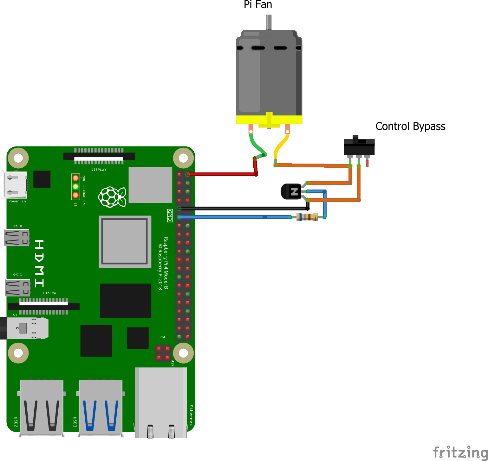
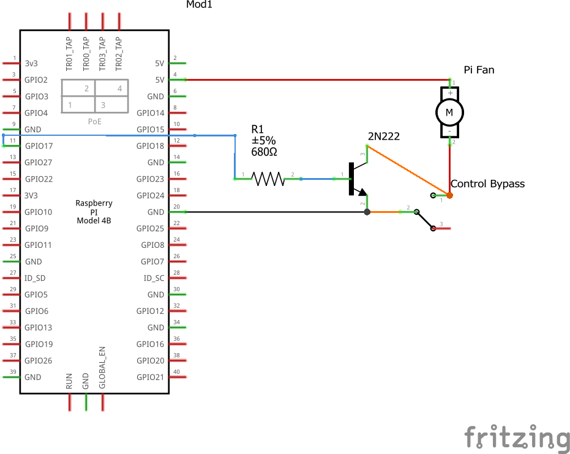
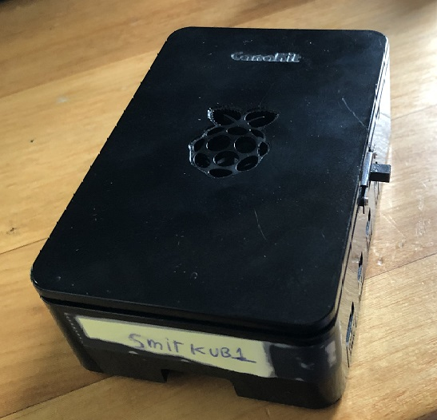
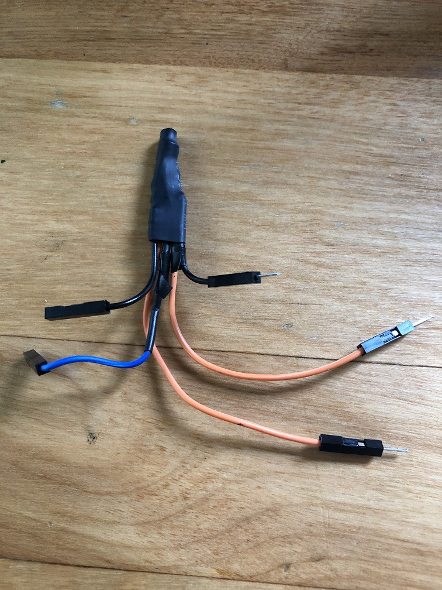
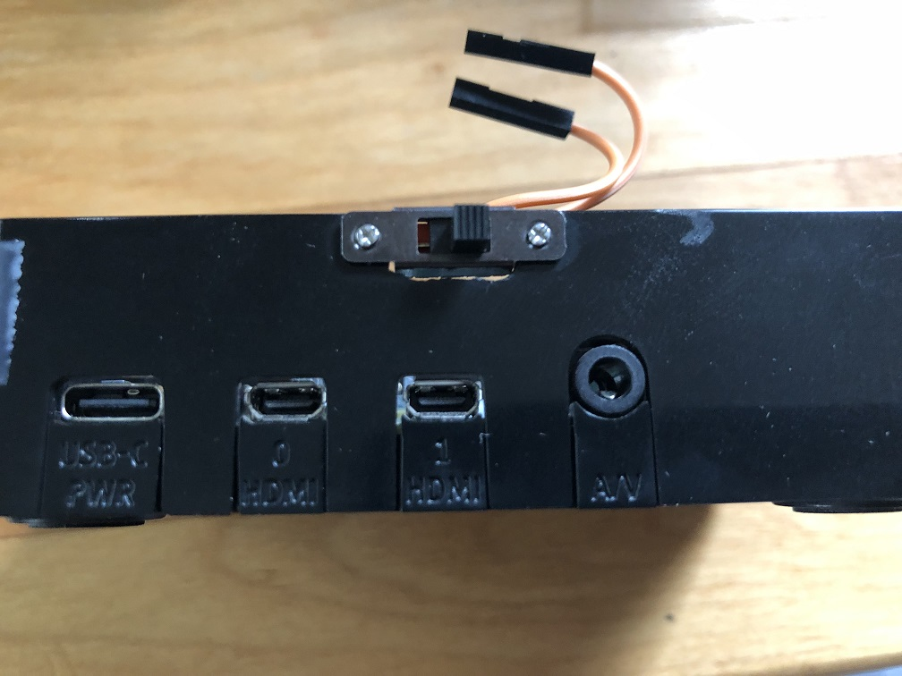
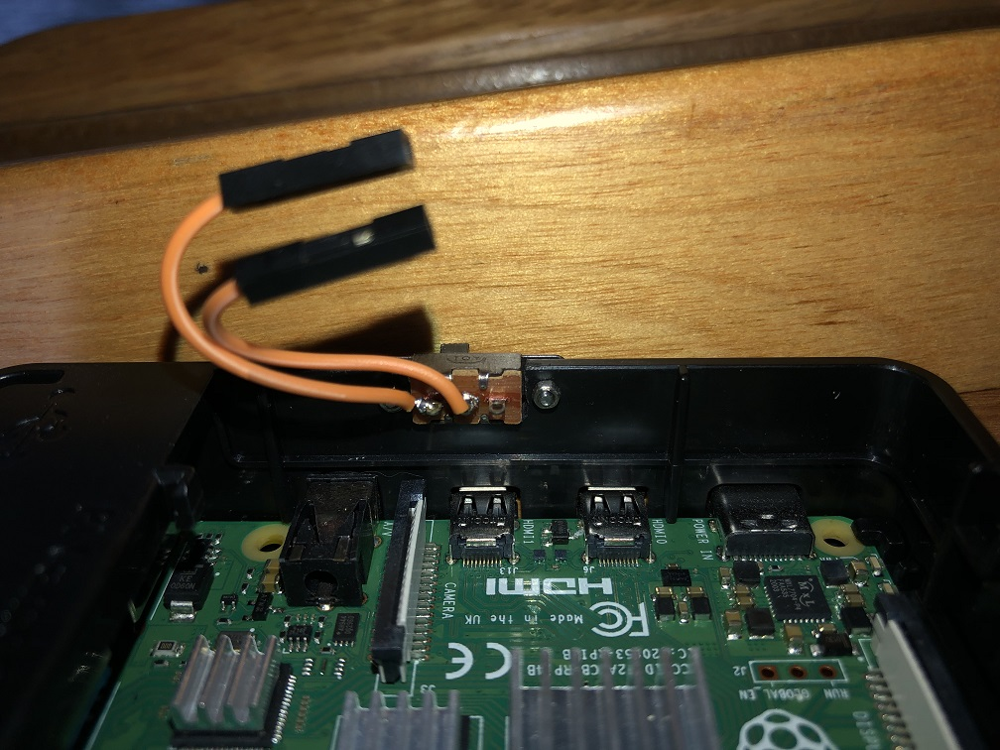
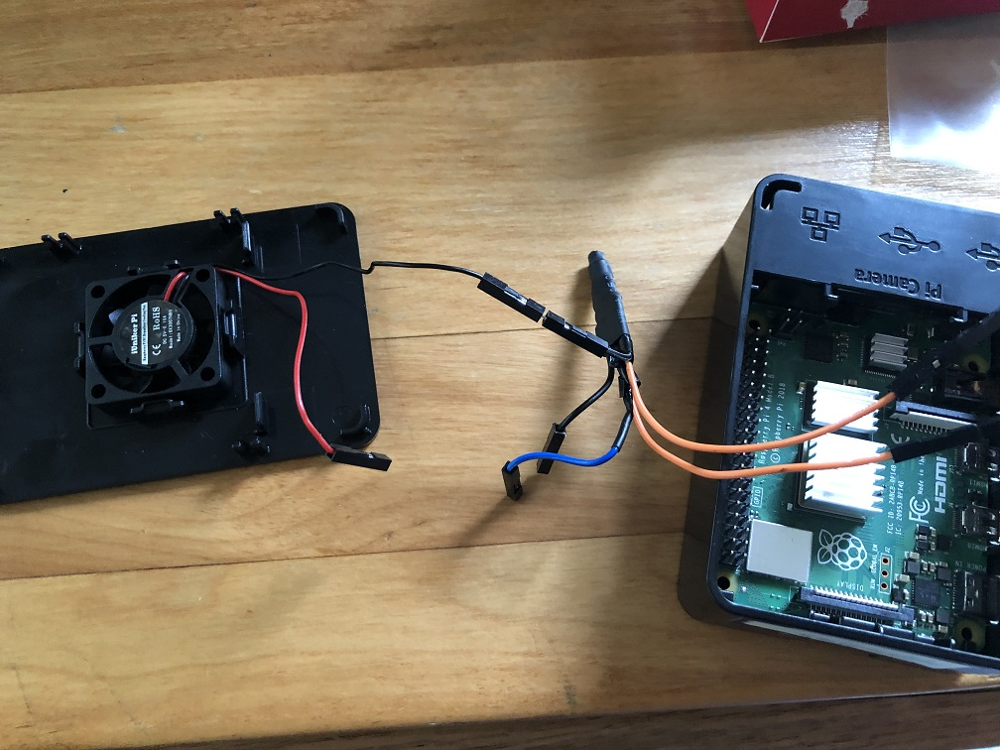
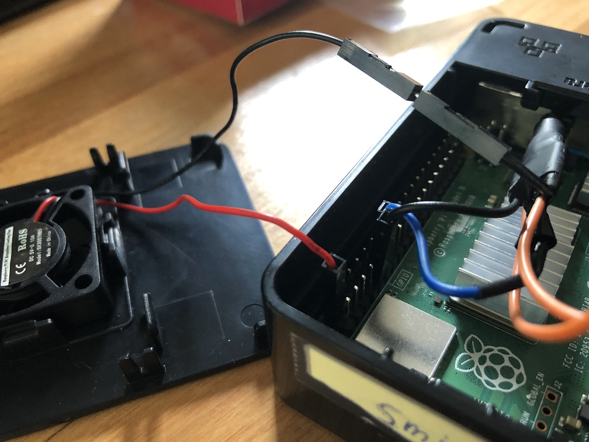

# **PICOOL**

- [**PICOOL**](#picool)
- [About](#about)
- [Resources/Parts/References](#resourcespartsreferences)
  - [Code](#code)
  - [Hardware](#hardware)
- [Diagram](#diagram)
  - [Breadboard](#breadboard)
  - [Schematics](#schematics)
- [Finished components](#finished-components)
    - [The final product](#the-final-product)
    - [The Squid](#the-squid)
    - [The Switch](#the-switch)
    - [Partial Hookup](#partial-hookup)
    - [Final connection](#final-connection)
- [Control Script](#control-script)
# About
This repository is primarily visuals and references around my modifications to the Raspberry pi 4b official plastic case in combination with the work done at [Howchoo](https://howchoo.com/g/ote2mjkzzta/control-raspberry-pi-fan-temperature-python). I decided to do this because im building home labs and appliances that will require RPI4's and the fan running constantly will drive me 100% insane.

This project differs from the original HowChoo by making the circuit modular, and by adding an override switch.

This will likely be rendered moot after the availability of the [Turing pi 2](https://turingpi.com/) becomes a thing. A proper ITX case + 120 or 200MM fan will keep a pi cluster nice and cool!

# Resources/Parts/References

## Code

* [Reference repository](https://github.com/Howchoo/pi-fan-controller)

## Hardware
Below are examples of what I used/ordered to complete this, depending on your case, you may wish to order different sized equipment. You may also be able to get smaller qty of the very specific parts we are going to use. These covered my needs.
* [QuadHands](https://www.amazon.com/gp/product/B00GIKVP5K/ref=ppx_yo_dt_b_asin_title_o00_s01?ie=UTF8&psc=1) - This makes soldering insanely easy.
* Soldering iron - Pick your preference out there. I did this with a $5, 22 year old soldering iron issued from DeVry.
* [Transistor/Resistor kit](https://www.amazon.com/gp/product/B07G46LNCG/ref=ppx_yo_dt_b_asin_title_o05_s01?ie=UTF8&psc=1) - This will contain the parts you need, and many you do not.
* [Jumper Kit](https://www.amazon.com/gp/product/B077N58HFK/ref=ppx_yo_dt_b_asin_title_o05_s01?ie=UTF8&psc=1) - This is highly useful to create a modular product that does not render the fan useless for other projects. 
* [Heat Shrink](https://www.amazon.com/gp/product/B07WWWPR2X/ref=ppx_yo_dt_b_asin_title_o05_s00?ie=UTF8&psc=1) - Good for Tidying up
* [Slide switches](https://www.amazon.com/gp/product/B08232XVL5/ref=ppx_yo_dt_b_asin_title_o02_s00?ie=UTF8&psc=1) - To toggle the software control override
* [Screw kit](https://www.amazon.com/gp/product/B075SBJN6Z/ref=ppx_yo_dt_b_asin_title_o01_s00?ie=UTF8&psc=1) - For mounting the slide switches
* [RPI Case](https://www.canakit.com/raspberry-pi-4-case.html) - This is the case i am modifying to a toggle switch to
* A Dremel or any other tool used to create a slot for the slide switch
* A drill for the switch mounting holes 

# Diagram
These diagrams were created using [Fritzing](https://fritzing.org/) and i highly recommend it for any hobbyists who want a nice looking diagram that will produce Breadboard, Schematic and BCP diagrams simultaneously! Its a steel at $10.

## Breadboard


## Schematics


# Finished components
### The final product

All buttoned up. This is what you will hopefully have at the end of this project! Keep this in your head as you work towards the finish line!



### The Squid

The final, heat-shrinked modular circuit. 




### The Switch

Mounted, front and rear, with female jumpers to accept the squid connection.





### Partial Hookup

Here you can see the circuit attached to the switch leads and the fan connected to the squid



### Final connection

Lastly we have our circuit completely attached.The Base to the GPIO, the collector from the can, and the emitter attached to ground to complete the circuit.




# Control Script
For this you can either follow the instructions from the [original project](https://github.com/Howchoo/pi-fan-controller), or read my instructions below.

This software leverages a combination of a python script, which polls the temperature and toggles output to the GPIO output to trigger the base depending on the temperature. It has a requirement for some pip modules. Pip modules are usually installed on a per-user basis, but since this needs to be globally accessible, you need to install them via sudo. You can find the requirements file in the root of this repository, then copy the fancontrol.py and fancontrol.sh files to their appropriate directory's (seen below)

___

**NOTE!** The requirements from the original repository reference specific versions of pip packages that do NOT work on ubuntu 22.04. the "latest" packages do seem to work, my updated file simply removes the version restriction. 
___

```
sudo apt install python3-pip

# Install requirements globally
sudo pip3 install -r requirements.txt

sudo cp fancontrol.py /usr/local/bin/
sudo chmod +x /usr/local/bin/fancontrol.py

sudo cp fancontrol.sh /etc/init.d/
sudo chmod +x /etc/init.d/fancontrol.sh

sudo update-rc.d fancontrol.sh defaults
sudo reboot
```

The configuration block for when the monitor willkick your fan on can be fond in the fancontrol.py file

```
#!/usr/bin/env python3

import time

from gpiozero import OutputDevice


ON_THRESHOLD = 65  # (degrees Celsius) Fan kicks on at this temperature.
OFF_THRESHOLD = 55  # (degress Celsius) Fan shuts off at this temperature.
SLEEP_INTERVAL = 5  # (seconds) How often we check the core temperature.
GPIO_PIN = 17  # Which GPIO pin you're using to control the fan.
```

To start or stop the applicaiton manually execute

```
/etc/init.d/fancontrol.sh (start or stop)
```

Thats it, you now have a temperature controlled fan for your Raspberry pi4!